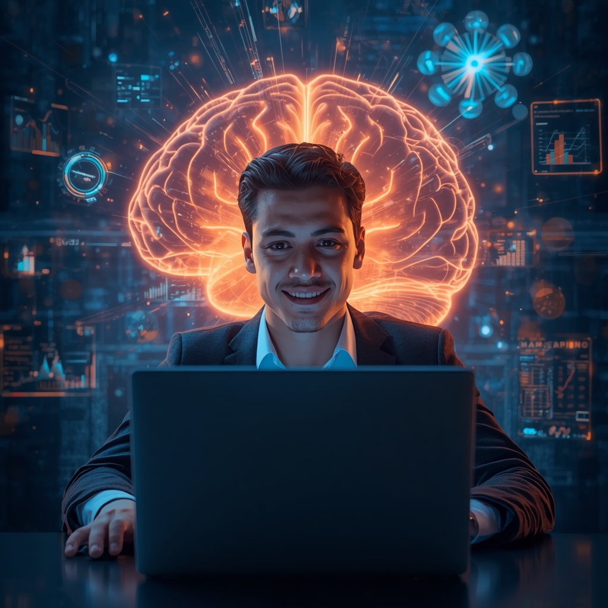
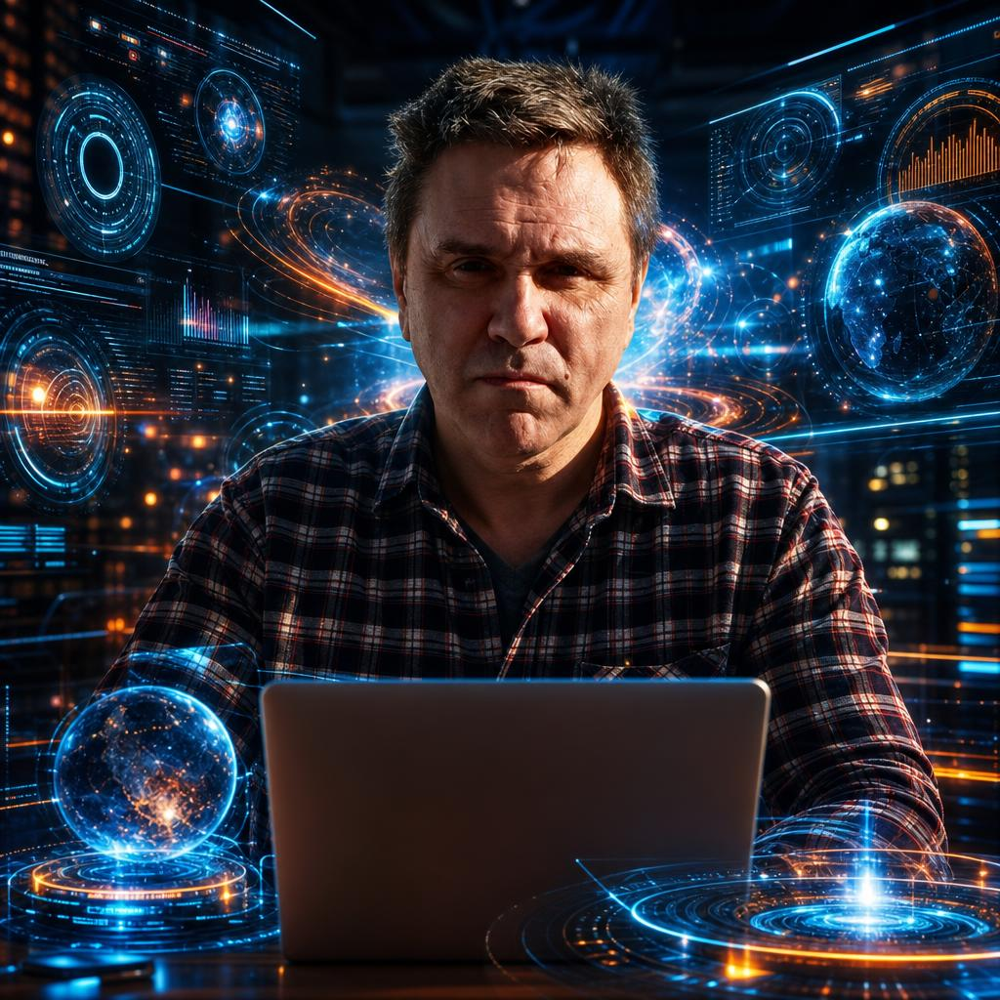
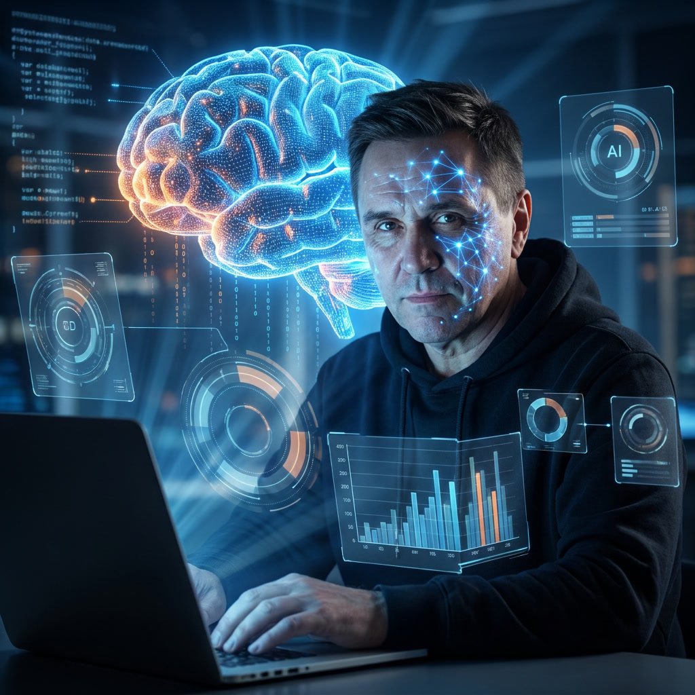

prompt для генерации 1-го изображения:
```
Young entrepreneur using artificial intelligence on a laptop, futuristic AI command center, face clearly visible and illuminated by glowing neural networks, **mouth closed, confident and determined facial expression, calm but powerful smile, look of intelligent control and visionary focus, no fear, no open mouth**, giant holographic digital brain behind him, explosive streams of data, **various holographic interfaces floating around him — data panels, 3D charts, circular UI elements, orbital infographics**, breakthrough moment, **expression of awe and joyful mastery**, cinematic sci-fi atmosphere, dramatic shadows, powerful blue and orange contrast, volumetric lighting, epic scale, ultra-realistic, attention-grabbing YouTube thumbnail style, viral social media cover, strong emotional trigger, highly detailed face, sharp focus, dynamic angle, futuristic technology everywhere, AI-generated holograms surrounding the subject, masterpiece, photorealistic, HDR, 8k, no text, no logo
```
Результат:


После добавления фото исправлен промпт для генерации изображения с моим лицом
```
Young entrepreneur using AI on a laptop, futuristic AI command center, face clearly visible and illuminated by glowing neural networks, mouth firmly closed, calm confident expression, look of intelligent control and visionary excitement without fear, explosive streams of data, various holographic interfaces floating around him — translucent data rings, 3D holographic charts, floating circular UI panels, orbital infographics, breakthrough moment, expression of awe and joyful mastery, cinematic sci-fi atmosphere, dramatic shadows, powerful blue and orange contrast, volumetric lighting, epic scale, ultra-realistic, YouTube thumbnail style, viral social media cover, highly detailed face, sharp focus on facial features, dynamic angle, futuristic technology everywhere, masterpiece, photorealistic, HDR, 8k, no text, no logo
```
Результаты:


Далее выбрал модель Nano Banana Pro с промптом:
```
Young entrepreneur using artificial intelligence on a laptop, futuristic AI command center, face clearly visible and illuminated by glowing neural networks, mouth firmly closed, calm confident expression, without smile, look of intelligent control and visionary excitement without fear, giant holographic digital brain behind him, explosive streams of data, various holographic interfaces floating around him — translucent data rings, 3D holographic charts, floating circular UI panels, orbital infographics, breakthrough moment, expression of awe and joyful mastery, cinematic sci-fi atmosphere, dramatic shadows, powerful blue and orange contrast, volumetric lighting, epic scale, ultra-realistic, YouTube thumbnail style, viral social media cover, highly detailed face, sharp focus on facial features, dynamic angle, futuristic technology everywhere, masterpiece, photorealistic, HDR, 8k, no text, no logo, same exact face as uploaded photos, identity preserved exactly, person looks 40 years old, age forty, mature but youthful appearance, subtle natural fine lines appropriate for age 40, smooth skin, no deep wrinkles, modern stylish haircut, trendy hairstyle, wearing fashionable smart casual outfit, modern jacket or designer hoodie, stylish streetwear
```
Результат:

