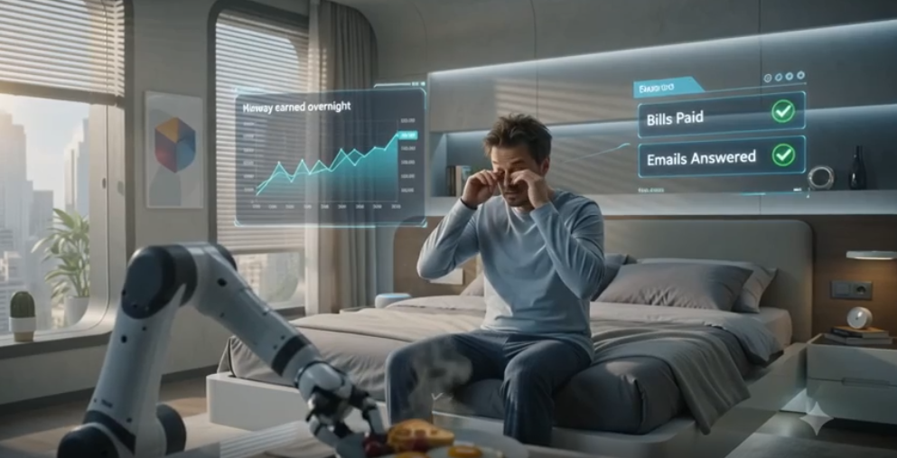
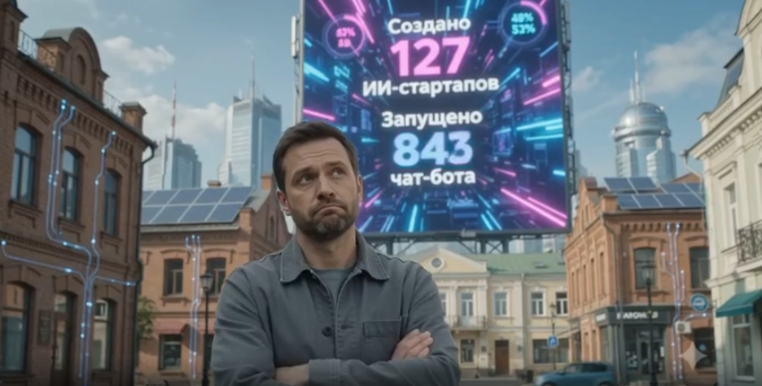
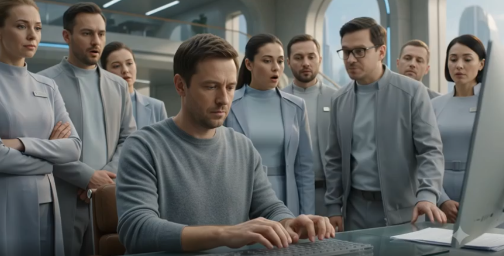
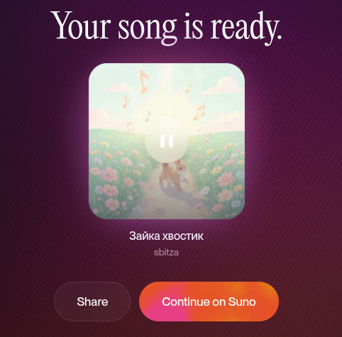
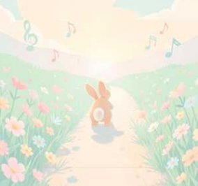

## Видео
Начало промпта у всех одинаковое:
```text
Create a cinematic, realistic, humorous AI-generated video, 10 seconds long.

Style: futuristic comedy, high production value, realistic characters, natural facial expressions, dynamic camera movements, smooth scene transitions, detailed environments, subtle humor, movie-quality visuals.

Setting: Year 2035. A small provincial town where AI agents have automated nearly every aspect of life.

All spoken dialogue must be in Russian with natural voice acting and accurate lip sync.

MAIN CHARACTER:
An ordinary 35-year-old man who begins to wonder what humans are supposed to do now that AI does everything.
```

Промпт 1:
```
SCENE 1 — MORNING

Wide cinematic shot of a futuristic apartment.

The man wakes up. A household AI has already prepared breakfast, paid all utility bills, answered emails, and earned money online overnight.

The man looks confused and asks in Russian:

"И что мне теперь делать?"

The AI calmly replies:

"Отдыхать. Вчера ты уже переработал. Целых три минуты."

The man stares silently at the breakfast table.

Comedic pause.

SCENE 2 — THE OFFICE

Modern office filled with relaxed employees drinking coffee and chatting.

Instead of humans working, dozens of AI agents operate holographic workstations.

The man walks through the office in disbelief.

One employee says:

"Мой агент сегодня повысил мне зарплату."

Another replies:

"А мой уволил начальника."

Everyone nods as if this is completely normal.
```
Результат:
[](https://disk.yandex.ru/i/bCXSJLLG4f9_Tg)

Промпт 2:
```text
SCENE 1 — STARTUP STATISTICS

Large futuristic digital billboard in the city center.
Animated statistics appear:

"127 AI startups created today"
"843 chatbots launched today"
The man asks:
"И сколько из них прибыльные?"
A narrator's voice answers:
"Ноль. Но презентации были великолепны."
The crowd applauds enthusiastically.

SCENE 2 — TOKEN WAR

Two AI agents are shown arguing online through holographic avatars.
The first AI proudly says:
"Я использовал пятьсот тысяч токенов для анализа."
The second responds:
"Слабак. Я потратил миллион токенов, чтобы доказать, что ты неправ."
Suddenly a giant red warning appears:
"Баланс владельца: минус 12 000 долларов"
Both AI agents continue arguing as if nothing happened.

```

[](https://disk.yandex.ru/i/QUh9KO5hdA279g)

Промпт 3
```
SCENE 1 — RARE HUMAN ACTIVITY

The man sits at a desk and begins writing an email manually without AI assistance.

People gather around him in amazement.

One person whispers:

"Смотри, он пишет письмо самостоятельно."

Another whispers:

"Не спугни его."

Several people take photos and videos as if observing an endangered species.

SCENE 2 — FINAL SCENE

Beautiful sunset in a futuristic park.

A drone walks a dog.

A robot mows the grass.

AI agents run businesses on holographic screens in the background.

The man sits alone on a bench, looking at the world around him.

He quietly says:

"Получается, нейросети делают всё..."

The AI responds from an invisible speaker:

"Нет. Кто-то же должен оплачивать подписку."

The man slowly looks into the camera.

Cut to black.

End title:

"AI Automated Everything"

Cinematic ending music. Light-hearted comedy tone. Realistic visuals. Natural Russian dialogue. Professional movie-quality rendering.
```
Результат:
[](https://disk.yandex.ru/i/kysEC-a4L63ldw)

## Песня
Текст:
```text
Куплет 1

Солнце утром улыбнулось,
Золотым лучом коснулось,
Птички весело поют,
Нас гулять с собой зовут.

Припев

Ля-ля-ля, ля-ля-ля,
Как прекрасна вся земля!
Ля-ля-ля, ля-ля-ля,
Улыбайтесь, друзья!

Куплет 2

По дорожке скачет зайка,
Машет хвостиком лужайка,
Ветер листьями шуршит,
Добрый день нам говорит.

```
### На suno
[](https://suno.com/s/ENm2yv5wQ9AG321Q)
### На Yandex Disk
[](https://disk.yandex.ru/d/Otz0hq4DHZFmwQ)

## Пост

Нейросети берут на себя рутину: от обработки писем до генерации отчётов и контента. Вам больше не нужно тратить часы на однотипные задачи — достаточно настроить автоматизацию один раз. Это освобождает время для живого общения, стратегии и творчества. Проще говоря: вместо того чтобы делать всё самому, вы становитесь дирижёром, который управляет умными инструментами.

[Озвучка](https://disk.yandex.ru/d/eMU6K8LJvPmwPQ)