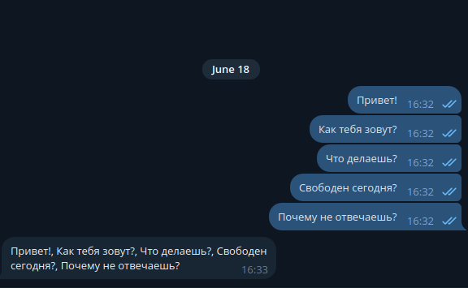
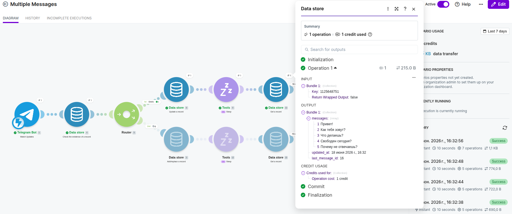
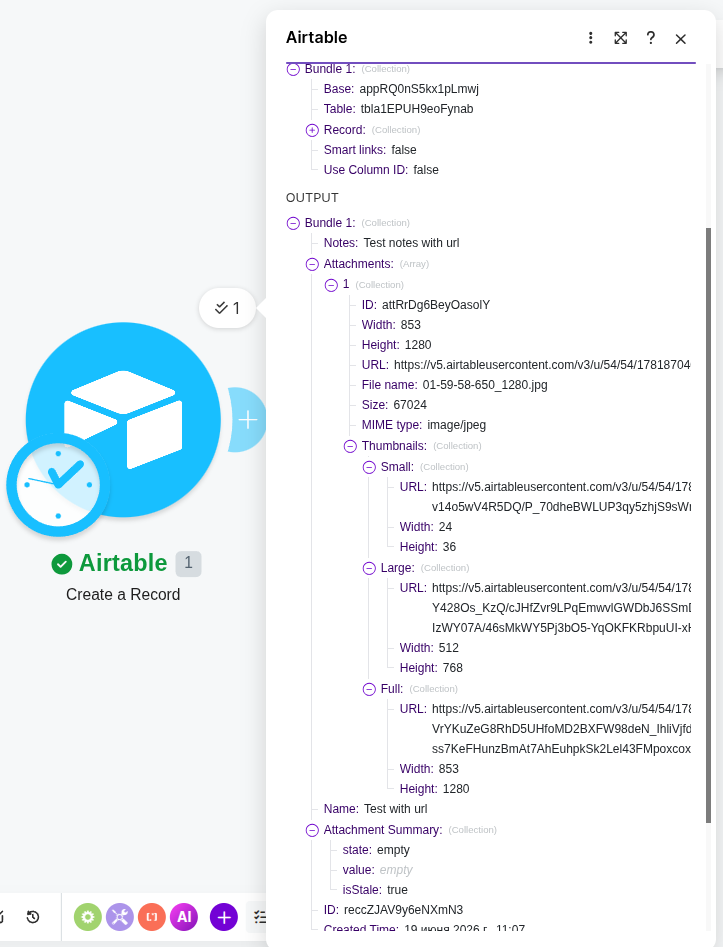
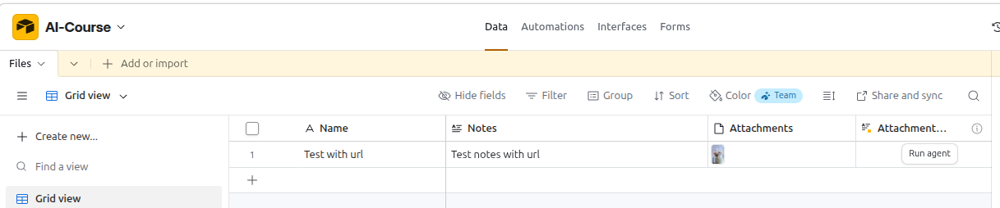
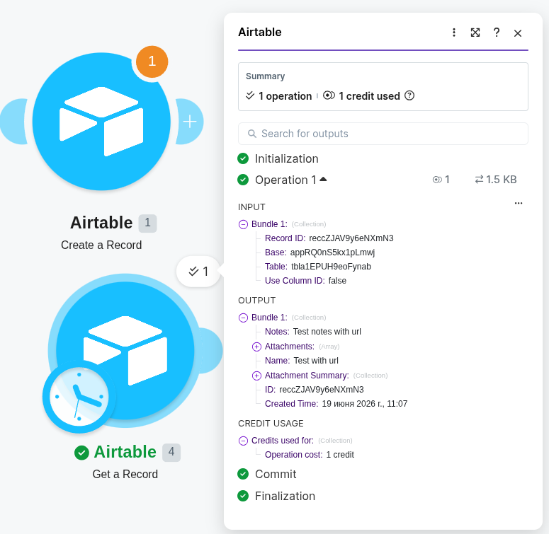
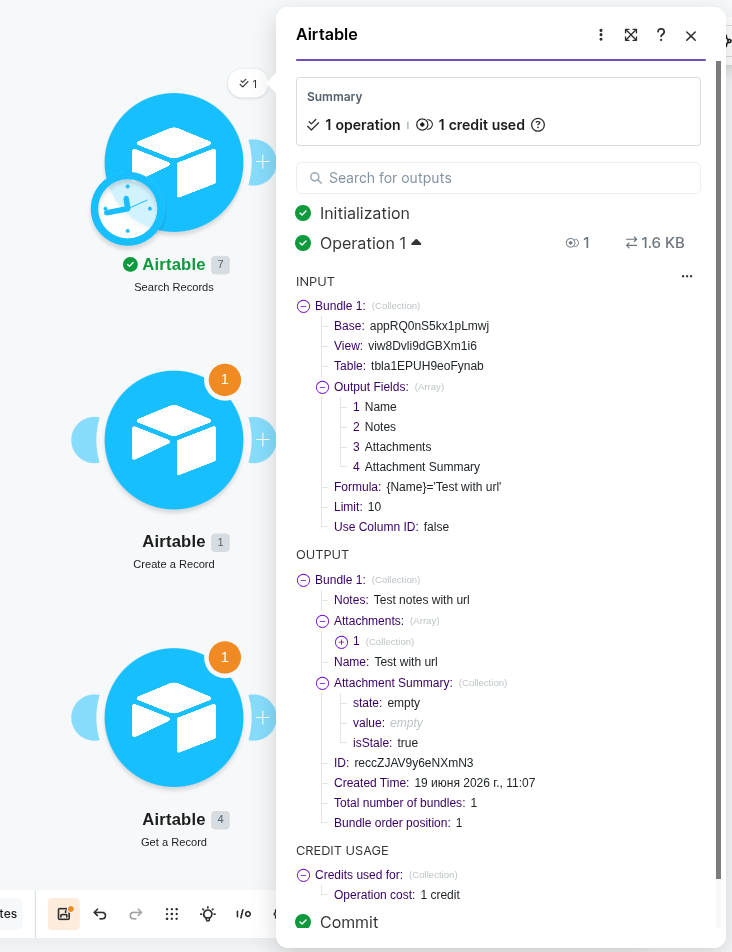
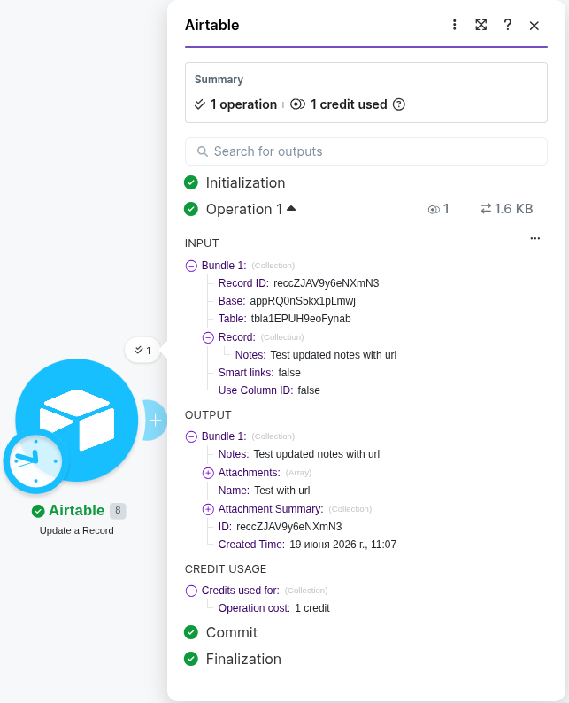
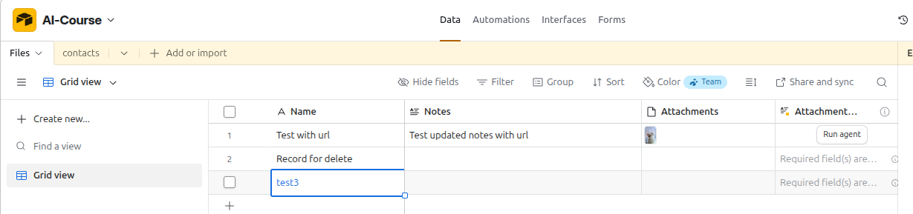
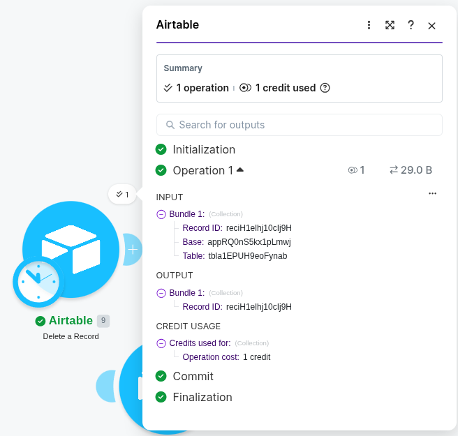

# Multiple Messages
## Поток сообщений
- Сообщения в телеграм:

- Сообщения в DataStore

# Airtable
## Create

Результат:

## Get a record

## Search a record

## Update a record

Результат

## Удаление
