# Создание персонального ассистента
## Сценарий добавления события
#### переменные

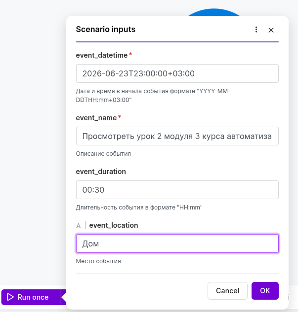

#### событие добавлено

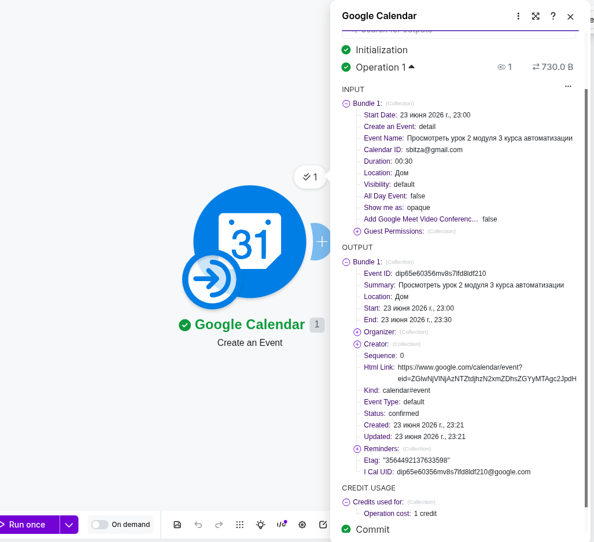

## Сценарий получения событий
#### переменные
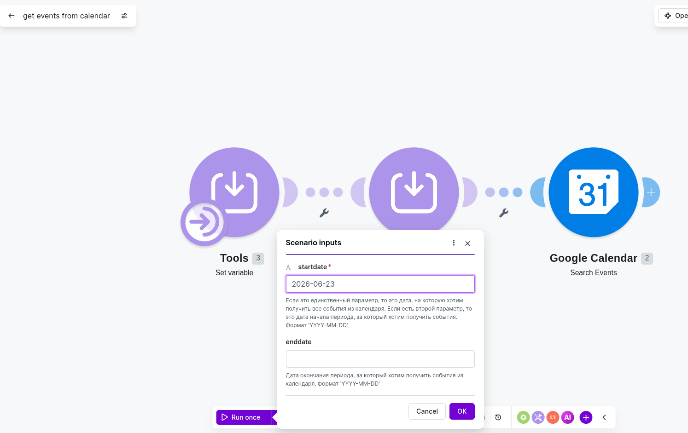

#### события получены
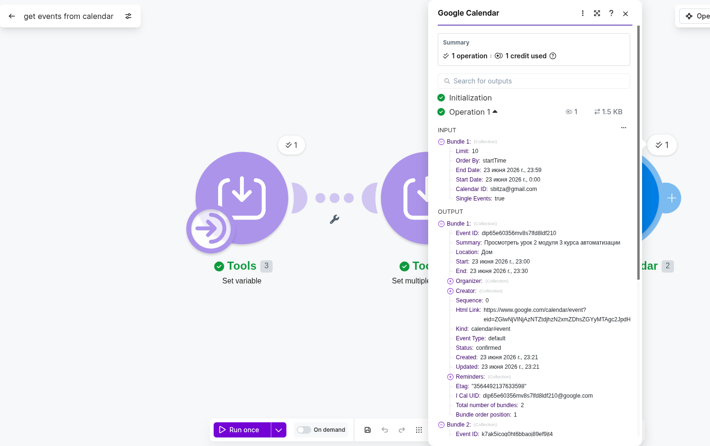

## Сценарий поиска в сети
В связи с тем, что интерфейс и инструменты make сильно изменились с момента выхода видео урока, пришлось изобретать сценарий самостоятельно.

В него включён Make AI Web Search модуль, но т.к. он не имеет системного промпта, то полученный ответ ещё прогоняем через DeepSeek API.
#### подготовка промпта для обработки ответа от Make AI Web Search в DeepSeek

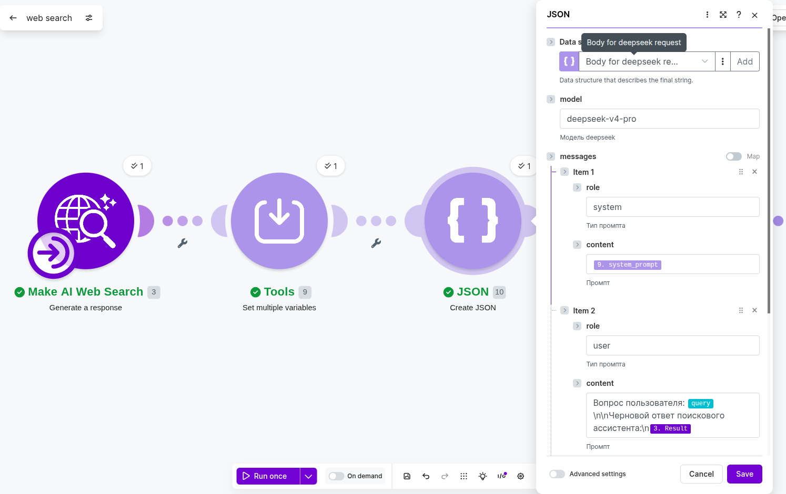

#### промпт подготовлен
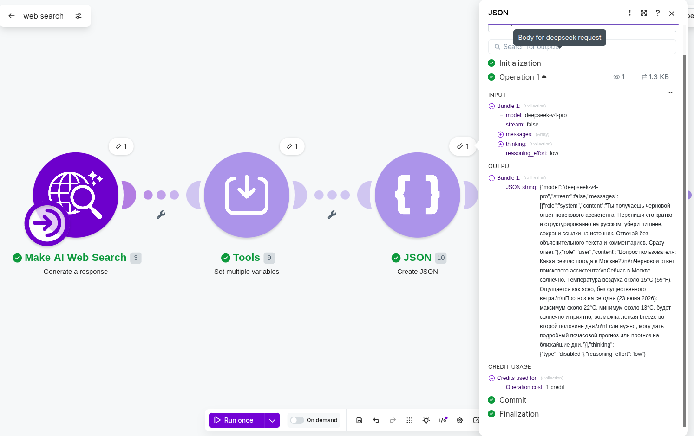

#### ответ от DeepSeek
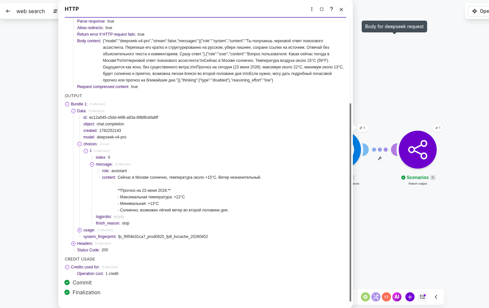

## Точка входа - телеграм бот
Чтобы разделить логику приёма запросов от пользователя от логики работы ассистента, а также избежать излишнего дублирования модулей в сценарии, принял решение выделить точку входа в отдельный сценарий от непосредственно сценария ассистента. Задача этого сценария - принять сообщение в телеграм и выдать текст, независимо от того, пришёл текст или голосовое сообщение.
Для распознавания текста был развёрнут whisper локально, на домашнем сервере. [compose.yaml](whisper/compose.yaml) и [инструкцию](whisper/README.md) прилагаю.

#### проверка распознавания текста

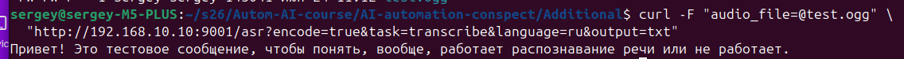

#### проверка из телеграм бота

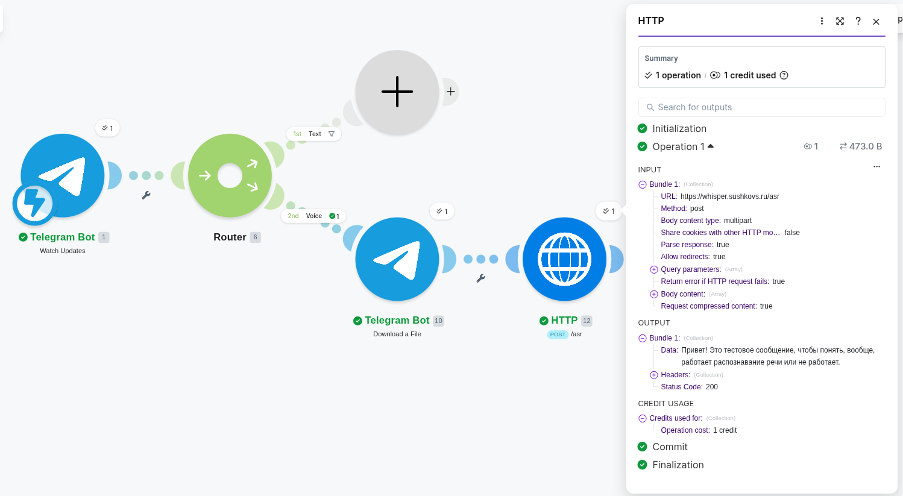

#### прохождение голосового запроса из телеграм на показ сегодняшних событий

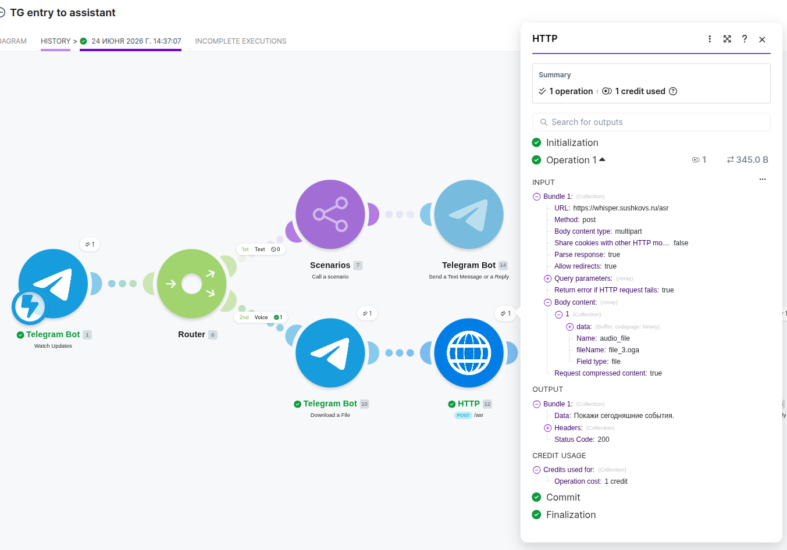

## Сценарий личного ассистента
[Промпт прилагаю.](system_prompt_for_personal_assistant.md)

#### Сценарий отработал
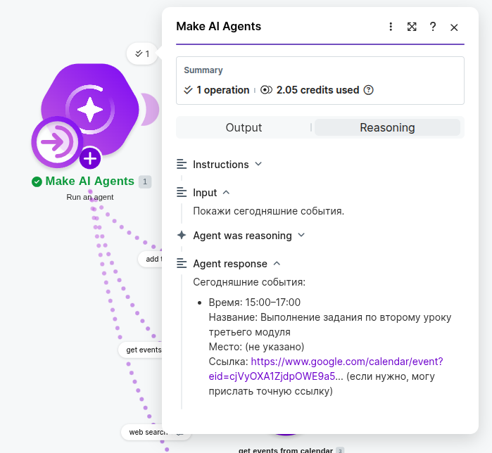

#### Результат в телеграм
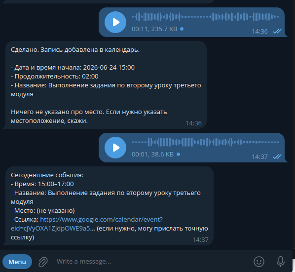

