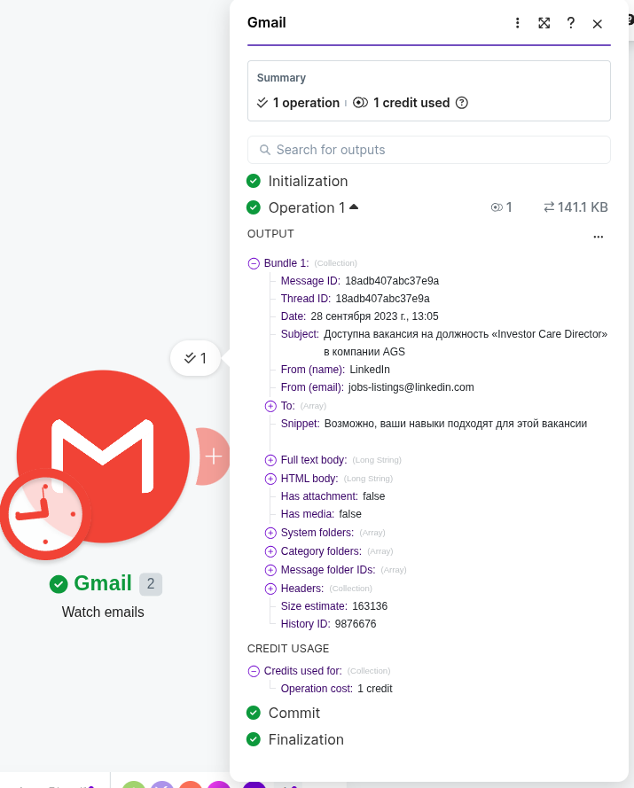
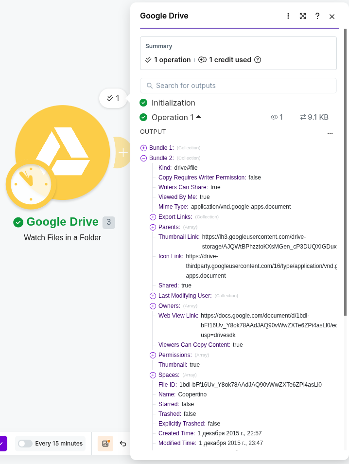
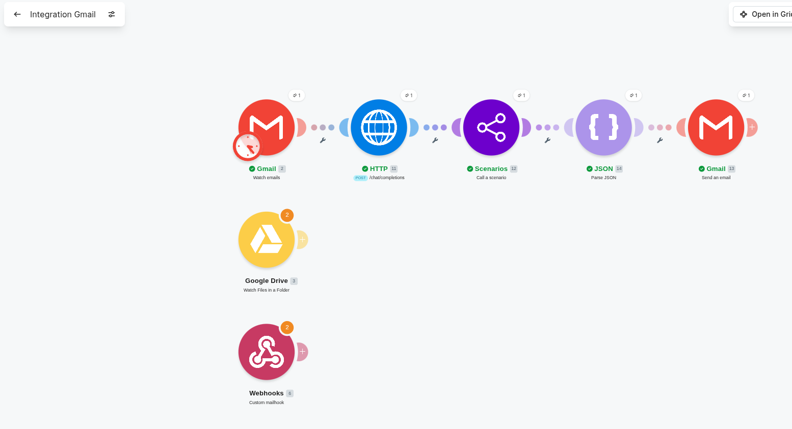
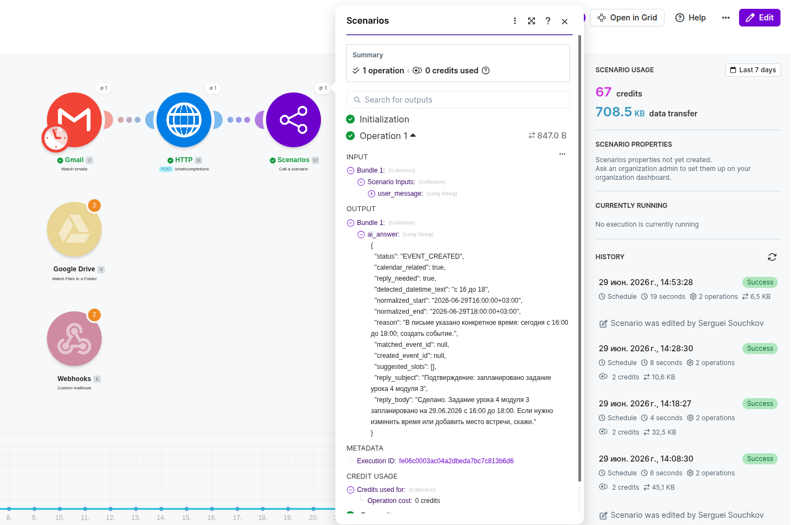
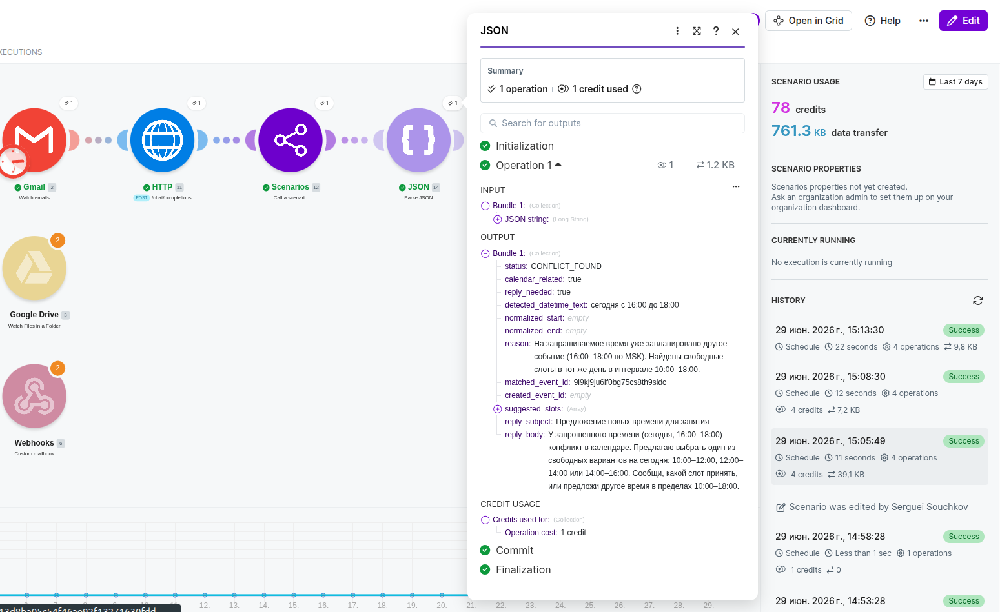

## Модуль GMail


## Модуль Drive


## Сценарий отработки почты


### Промпт для персонального ассистента
[Prompt](prompt-mail.md)

##### Тестовое письмо с текстом:
```
Сделай сегодня задание урока 4 модуля 3 с 16 до 18.
```
##### Ответ сценария:


##### При повторной просьбе сделать задание ответ:


### Итог
- Приложение в Google создано
- Модули Google Drive и Gmail активны
- Сценарий обработки почты собран
- [Системный промпт агента](prompt-mail.md)

### Примечание
На второй email ответ должен был быть о том, что данное событие уже есть в календаре. Но для этого требуется более тонкая настройка промптов, что уже выходит за рамки данного задания.