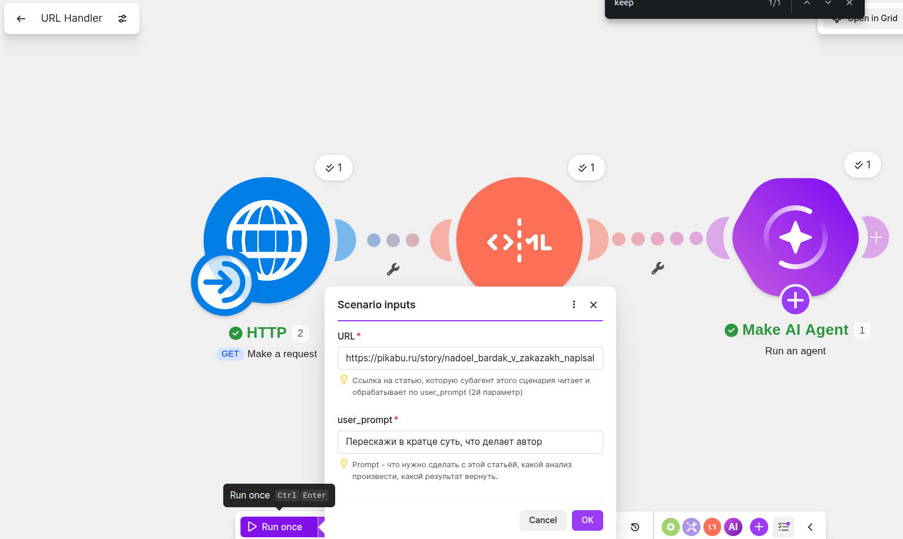
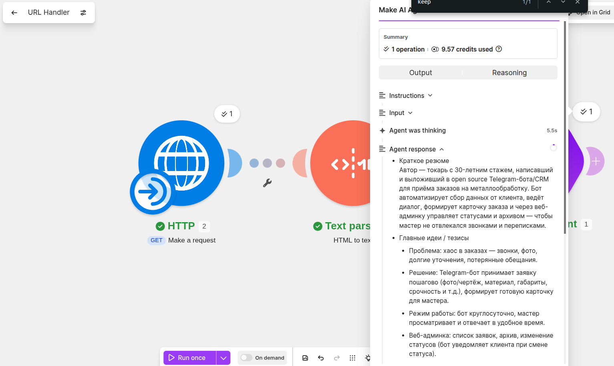
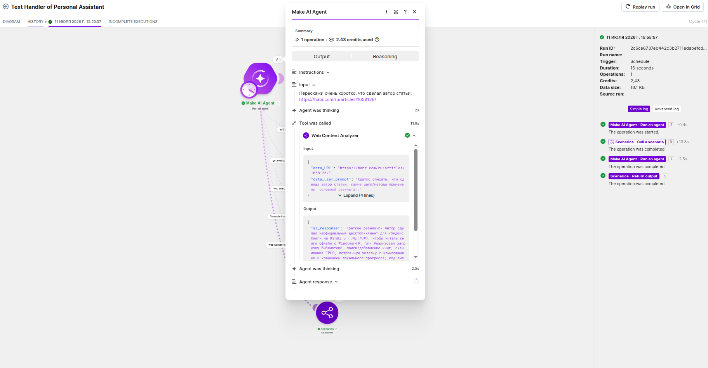
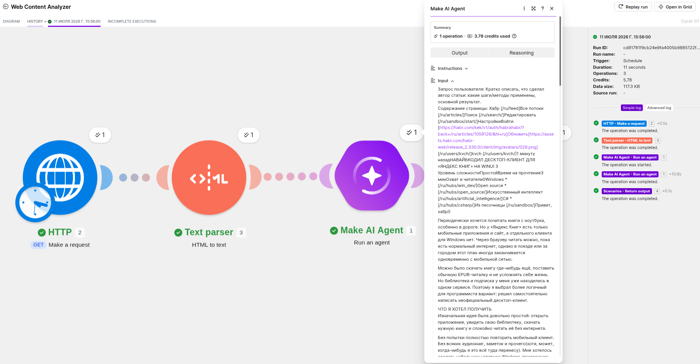
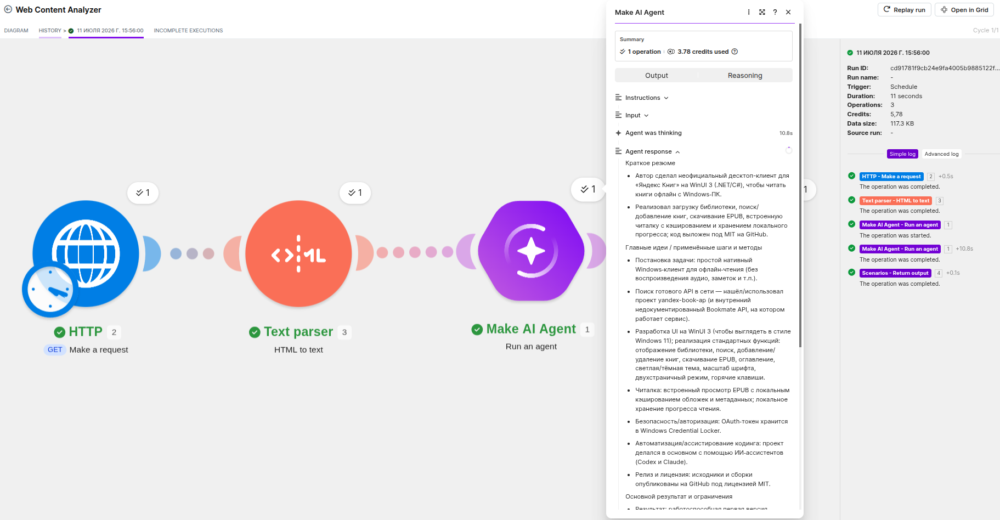
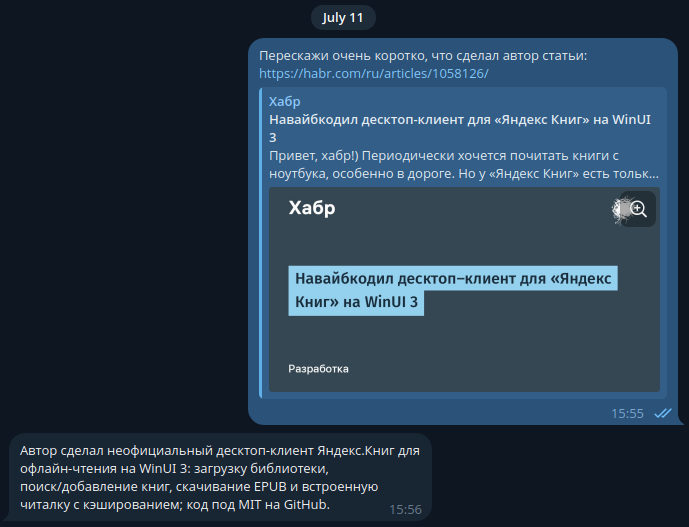

В качестве субагента решил добавить анализатора web страниц.
Для этого создал отдельный сценарий, который прпнимает на вход url и запрос от основного агента.
## Тестирование субагента
### Параметры запроса

### Ответ субагента

## Тестирование из телеграм
### Как отработал агент

### Промпт субагенту

### Ответ субагента

### Результат в телеграм
