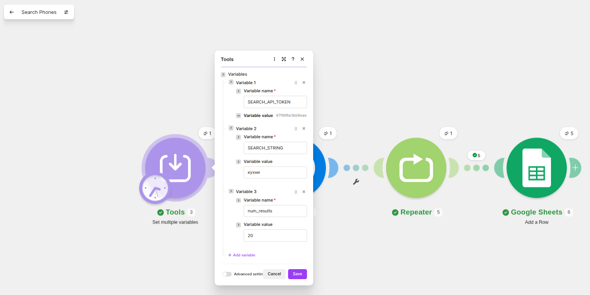
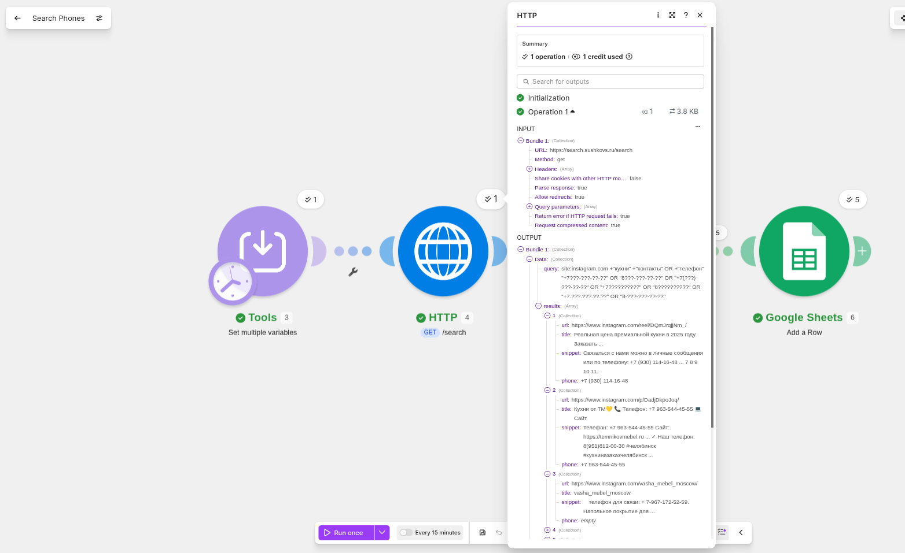
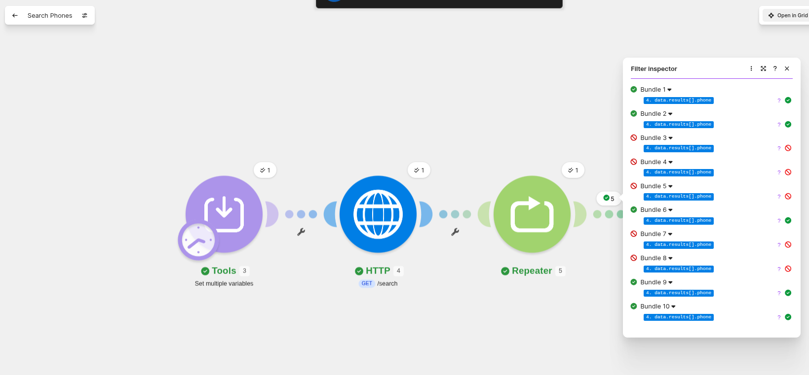
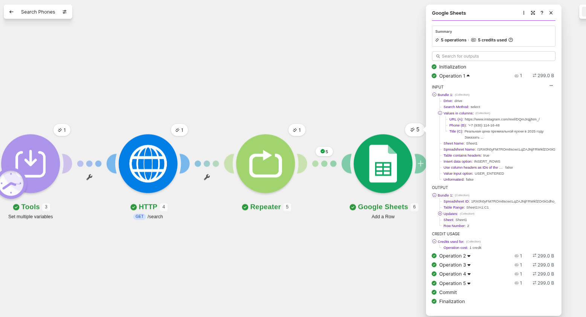
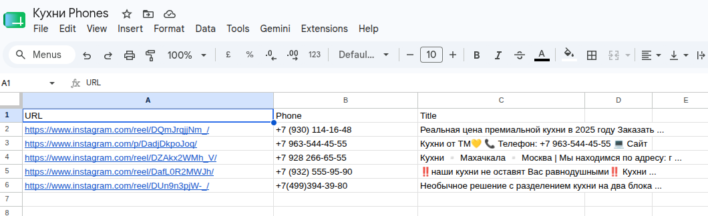

В связи с ограничением tiral Dumplingai.com в 3 дня

Было принято решение использовать другой сервис для поиска телефонов в Google, а именно, [SerpAPI](https://serpapi.com), который даёт 250 бесплатных ежемесячных запросов.

Для использования этого API принял решение навайбкодить и развернуть [собственный API](https://github.com/SergueiMoscow/phone-search-api), который использовал для выполнения настоящего ДЗ.

Свой API временно развернул на [домашнем сервере](https://search.sushkovs.ru/search)

## Определение переменных для запроса

## API отработал и выдал результат

Т.к. в коде уже встроен механизм отбора номеров телефонов из snippet, модуль Text Parser опускаем.

## Фильтр по наличию номера телефона

## Запись в Google Sheet

## Результат в таблице
