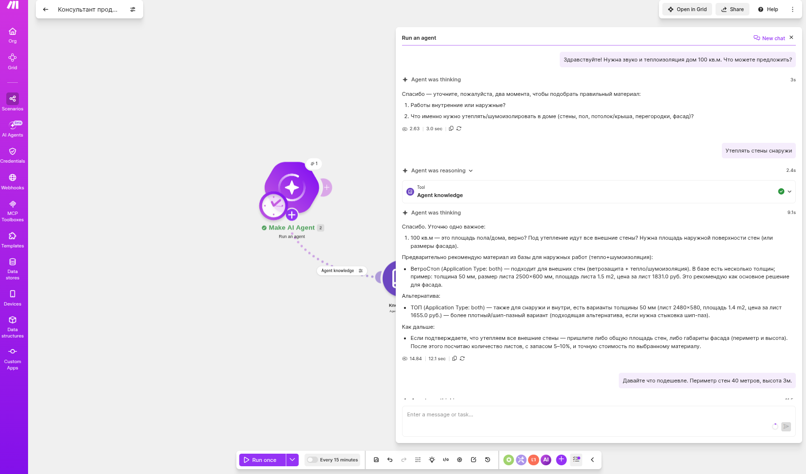
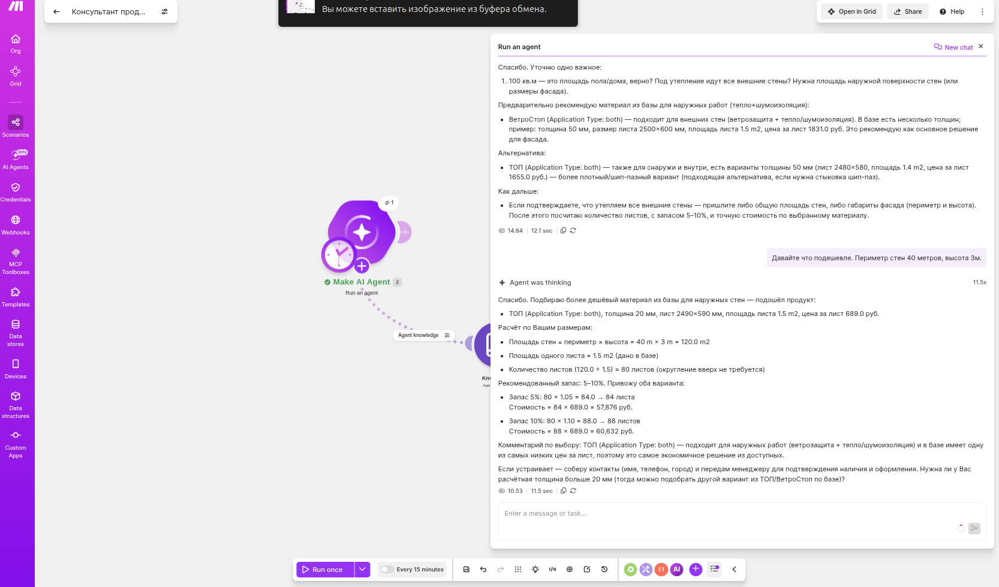
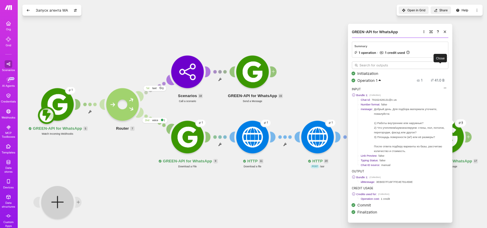

## Создание агента

Решил всё-таки попробовать с JSON. Промпт для manus скорректировал: [prompts](doc/prompts.md)

Результат: [json](doc/products.json)

[Промпт для агента](doc/system-prompt.md)

## Сценарий
 
