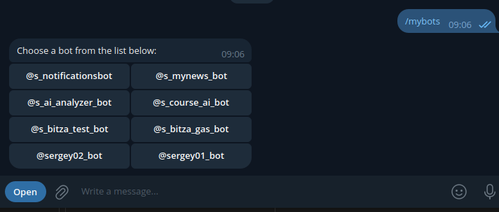
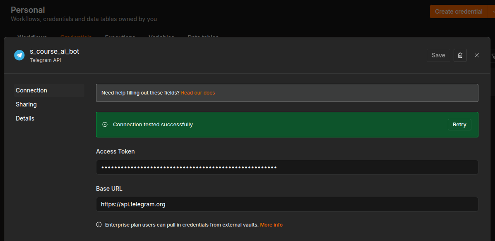
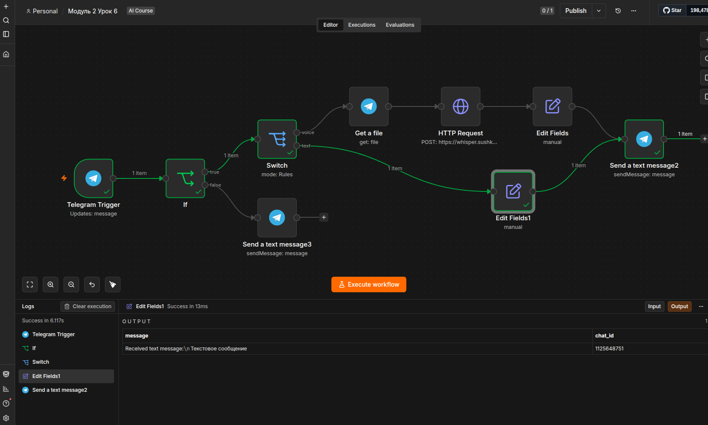
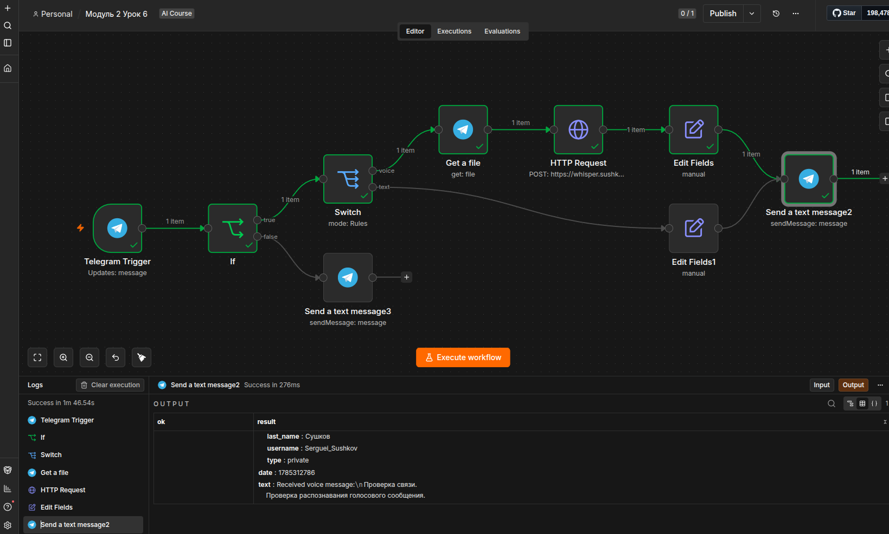
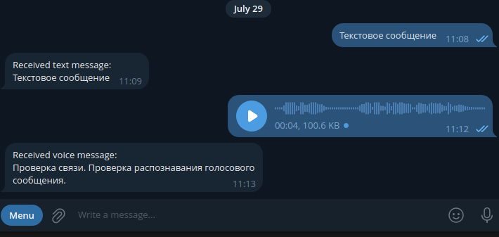
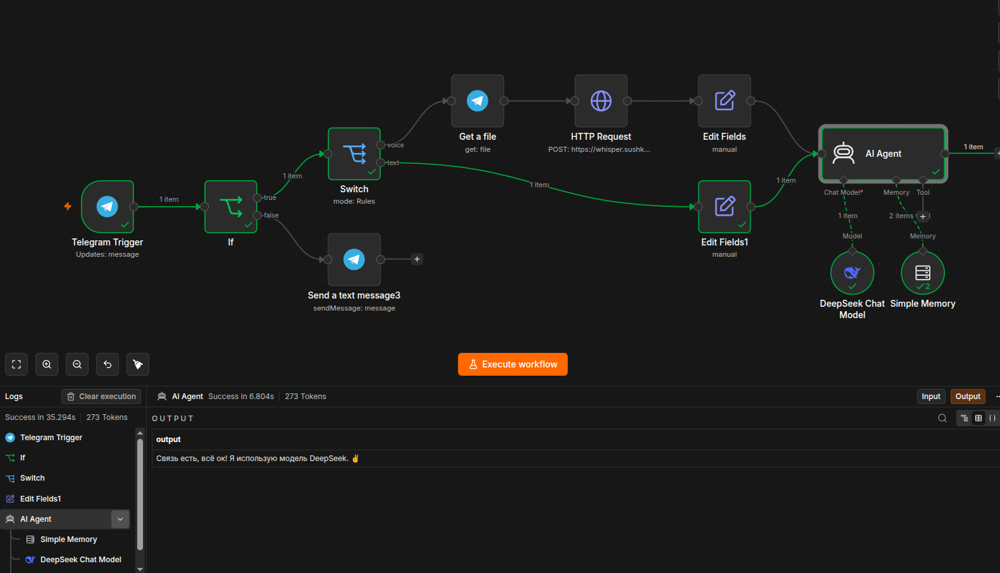
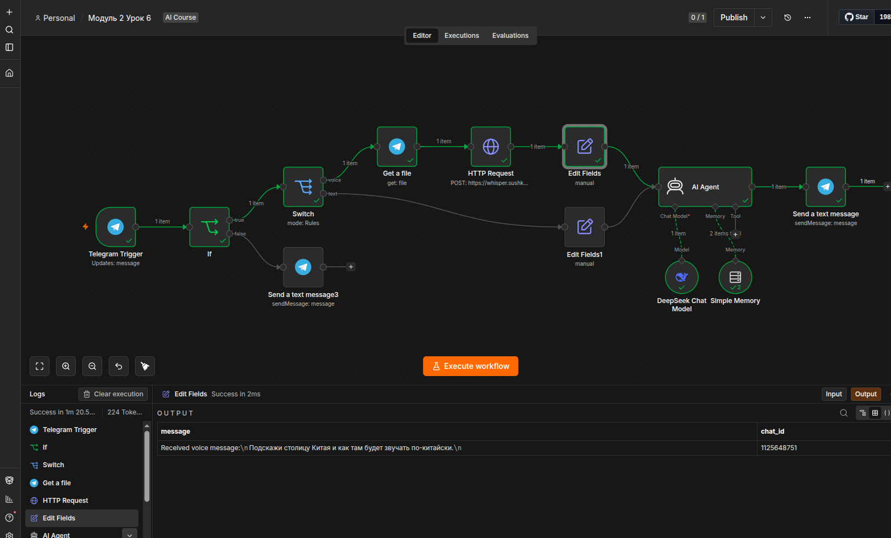
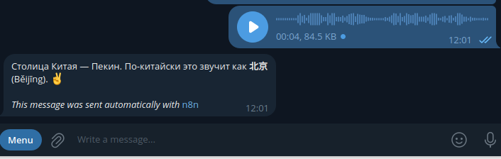
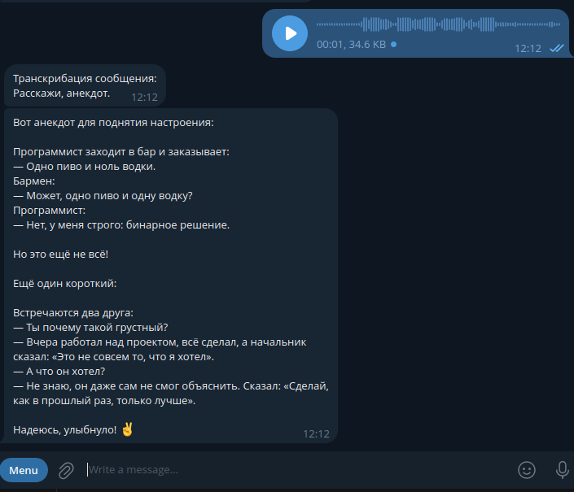

### Бот в телеграм
Не вижу смысла создавать нового бота, у меня их достаточно

### Подключение бота

### Пришло текстовое сообщение

### Голосовое сообщение распознано

### Проверка агента

### Добавление ответа

### Проверка ответа в телеграм

### Добавление транскрибации вопроса перед ответом

