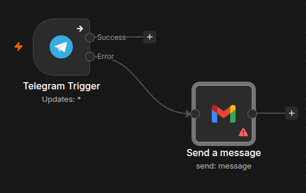
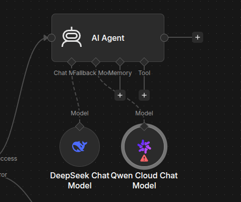
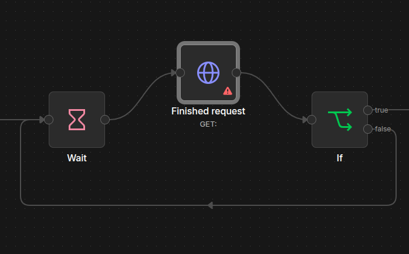
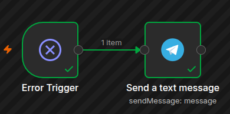

## Причиы ошибок
- Неверные или просроченные credentials, недостаточно прав у токена.
- Ошибки в данных: пустые поля, неожиданный формат, несовпадение типов.
- Неправильно настроенные webhook’и: тестовый URL вместо production, неверный метод запроса, проблемы с CORS или безопасностью.
- Таймауты и медленные внешние API, особенно в HTTP Request.
- Лимиты сервисов и rate limit при слишком частых запросах.
- Отсутствие обработки ошибок, retries и fallback-веток.
- Сетевые сбои, firewall, прокси, нестабильное соединение.

## Нода с веткой error, подключённой к уведомлению

## Включённая fallback-модель

## If - wait

## Error Trigger
Обещанные workflows к уроку не приложены. Вместо этого собрал свой Error Handler для подключения к workflows.
