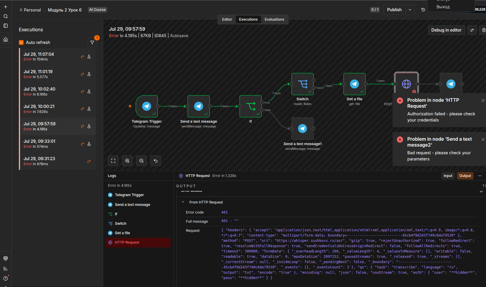
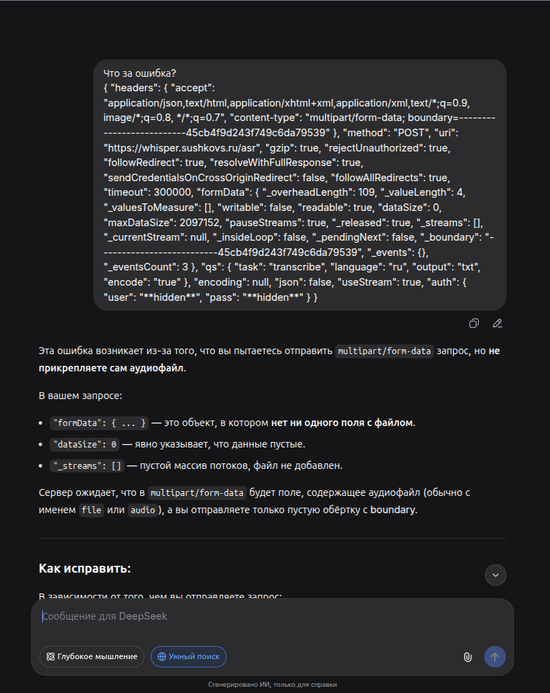
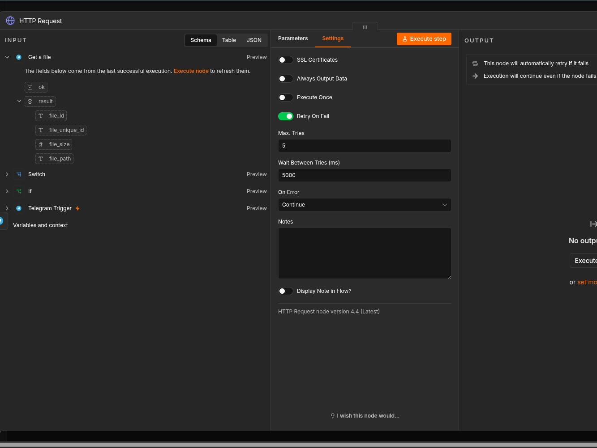
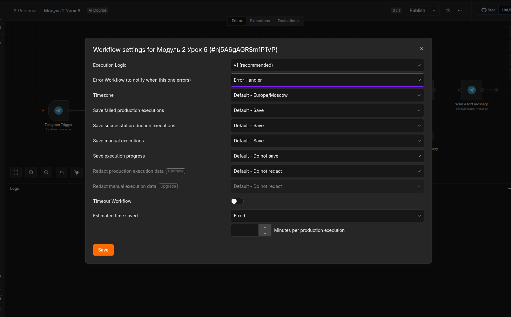

## Логирование
Логирование ошибок — это запись сведений о сбоях и важных событиях во время работы workflow, чтобы потом быстро понять, что сломалось, где и почему. В n8n это особенно полезно для отладки, мониторинга и построения устойчивых сценариев.

### Способы логирования
- Error Trigger
- Execution log 
- Записи во внешние хранилища
- Алерты в мессенджеры или почту

## Логирование через Executions

## Расшифровка ошибки через нейросеть

## Настройка ретраев (Retry On Fail)

## Поведение после исчерпания попыток

В данный сценарий больше вписывается такой вариант, т.к. дальнейшее прохождение после ошибки не имеет смысла. Там не накапливаются данные, т.к. нет циклов.